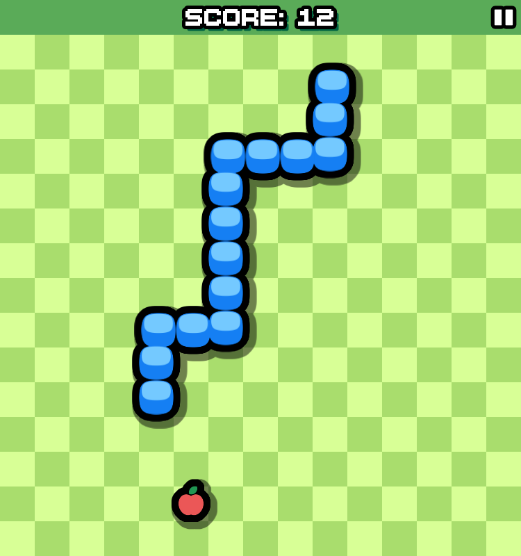
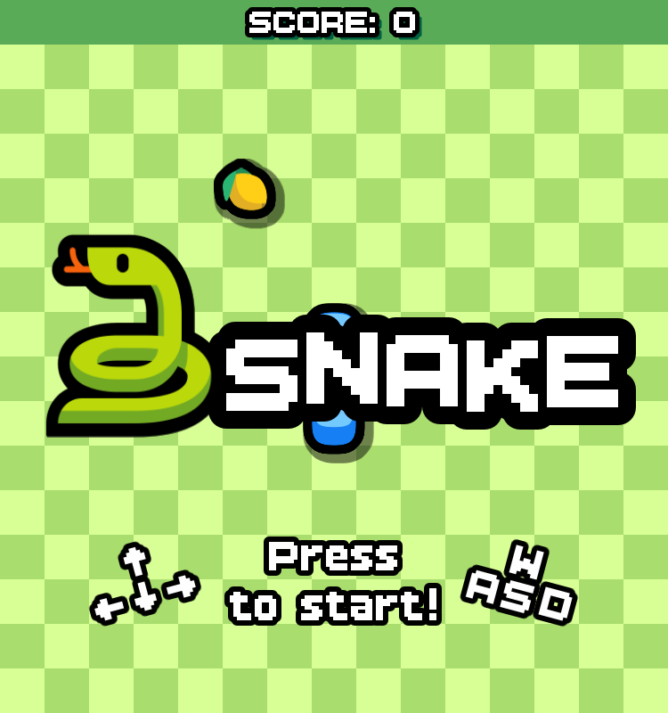
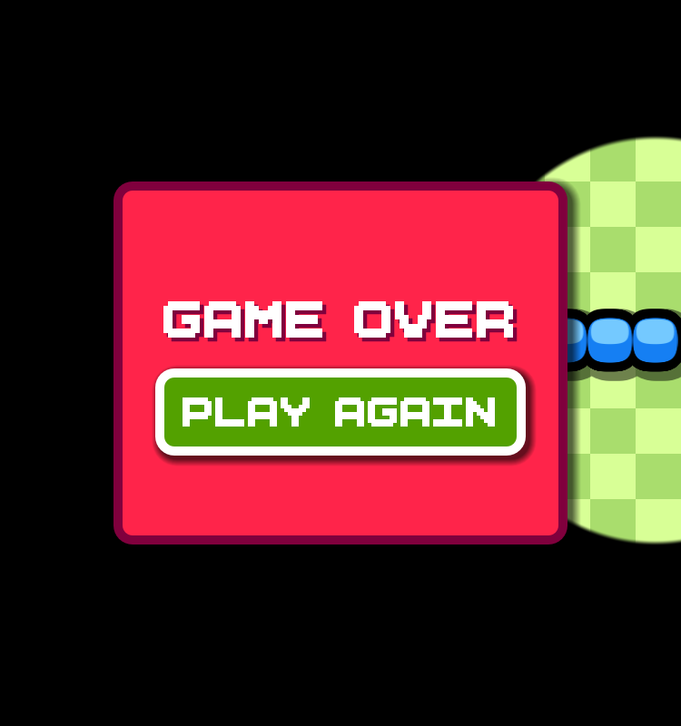

<h1 align="center">🐍Snake</h1>

A simple snake game made with Godot.

    
    
    

## Features

Some good stuff in this small project:
- Lite and fast ⚡
- Animations with `Tween` and `GPUParticles2D`
- Outlined `Panel` group via `SubViewport`, `ViewportTexture`, and shaders
- Transitions with shaders, signals, tweens, and player's coordinates
- Barebones and easy to extend from

## Motivation
To learn and experience the following:
- Make a simple snake game but a bit ***JUICED UP*** and optimized
- Animate fake heights in 2D space via tweens
- Animate smooth snake movement in grid coordinates via tweens
- Animate with the use of `CurveTexture` curves on `GPUParticles2D`
- Apply multiple layers of shaders with the use of viewports and textures
- Have some insight on shaders (very little atm.)
- Manage signals and its parameters
- Manage game states and scenes (i.e. pause state and *GameOver* screen)

## Credits

Here are credits to third-party assets I've used with their respective licenses.

### Fonts
- [BoldPixels](https://yukipixels.itch.io/boldpixels) Font by Yūki [(@YukiPixels)](https://linktr.ee/yukipixels) (CC BY-SA 4.0 license)

### Audio
- Generated sfx via [ChipTone](https://sfbgames.itch.io/chiptone) tool by [SFBGames](https://sfbgames.itch.io/) (CC0 license)

### Shaders
- [Simple circle transition](https://godotshaders.com/shader/simple-circle-transition-3/) by [Elephando](https://godotshaders.com/author/elephando/) (CC0 license)
- [2D Circular Outline Shader](https://godotshaders.com/shader/2d-circular-outline-shader/) by [alfroids](https://godotshaders.com/author/alfroids/) (CC0 license)
- [All in one outline shader](https://godotshaders.com/shader/all-in-one-outline-shader/) by [gnamimates](https://godotshaders.com/author/gnamimates/) (CC0 license)

### Icons
https://opensvg.dev/icons
- apple by Goran Spasojevic (MIT license)
- lemon by Emoji One (CC BY-SA 4.0)
- grapes by Twitter (CC BY 4.0)
- circle, Material by Google (Apache 2.0 license)
- cursor by ProCode (MIT license)
- hand-pointing-down-02 by Hugeicons